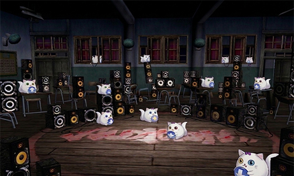

<html lang="zh-Hant">
<head>
    <meta charset="UTF-8">
    <meta name="viewport" content="width=device-width, initial-scale=1.0">
    <title>勁舞團 9 週年找碴大賽</title>
    
</head>
<body>

    <h2>🎯 找看看有幾隻哈特？</h2>
    
請先填寫基本資料開始遊戲

    
    <input type="text" id="username" placeholder="您的勁舞團(快樂玩)帳號" required>
    <input type="text" id="nickname" placeholder="您的勁舞團暱稱" required>

    

        
        
        
🔍 請問圖中總共有幾隻哈特貓？

        
        <select id="catCount">
            <option value="">-- 請選擇數量 --</option>
            <option value="10">10 隻</option>
            <option value="12">12 隻</option>
            <option value="16">16 隻</option>
            <option value="18">18 隻</option>
            <option value="20">20 隻</option>
        </select>
    

    <button onclick="submitGame()">提交結果</button>

</body>
</html>
